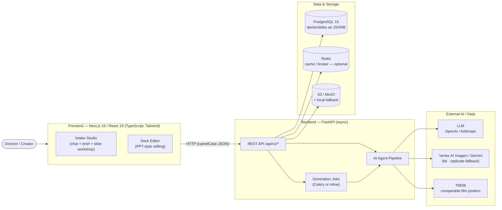
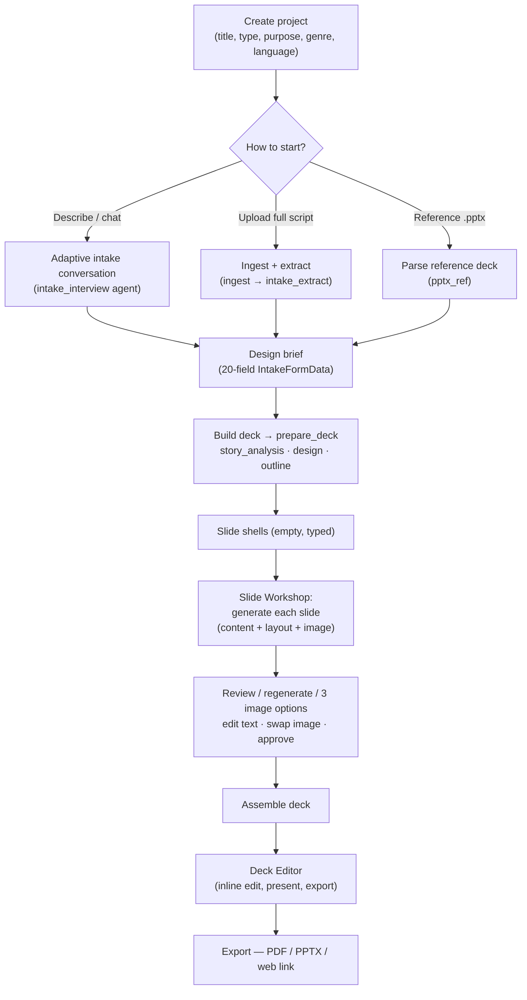
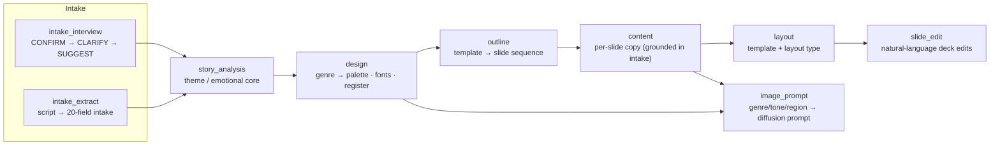
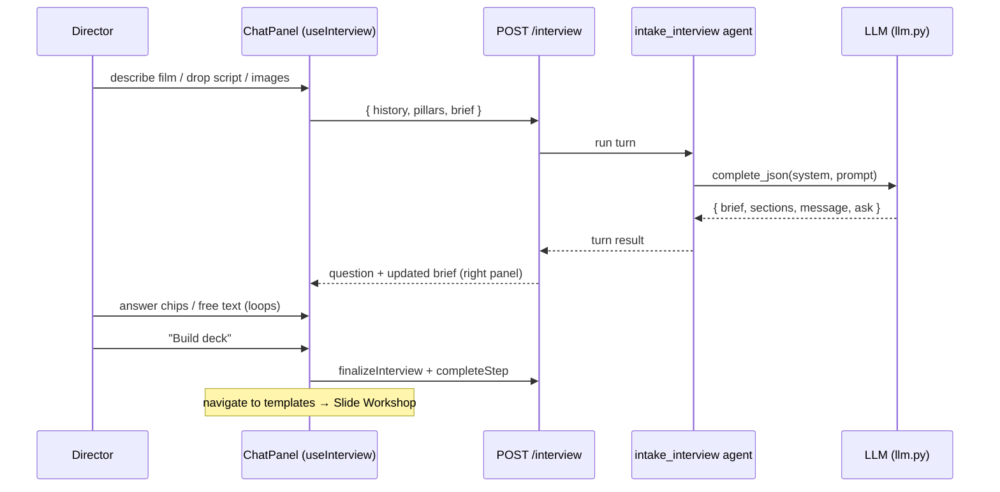
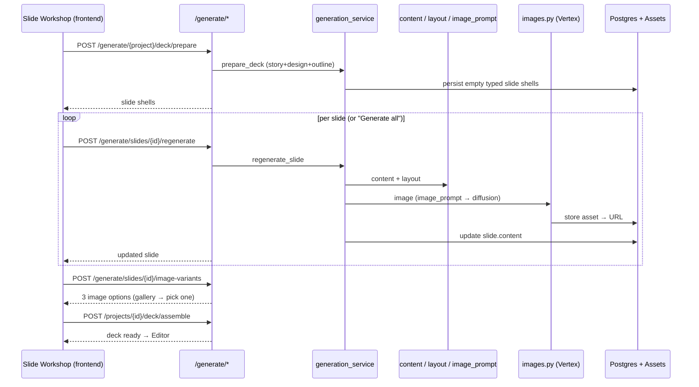
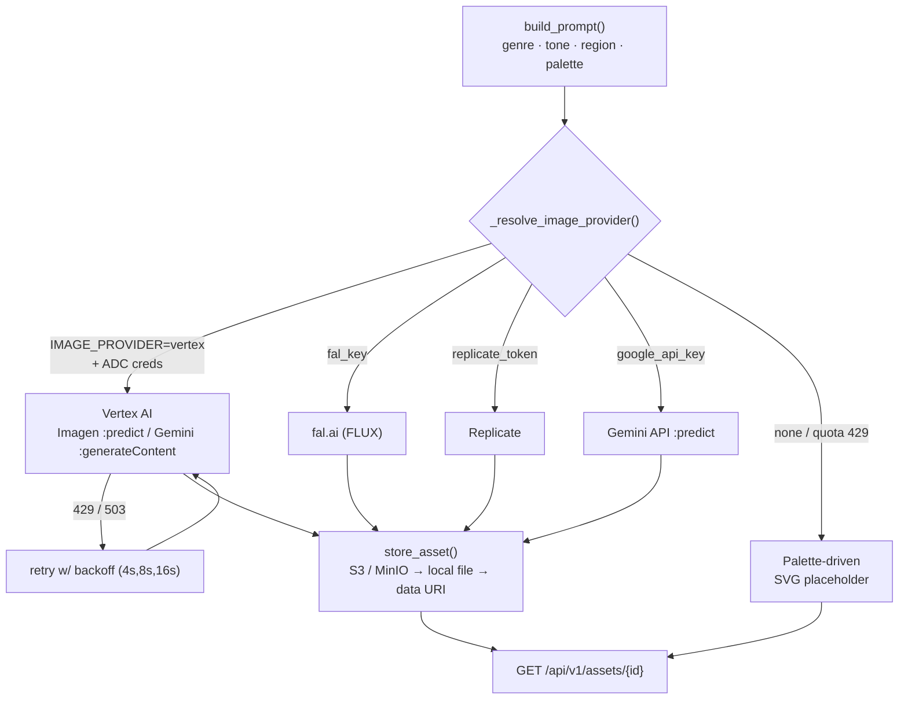
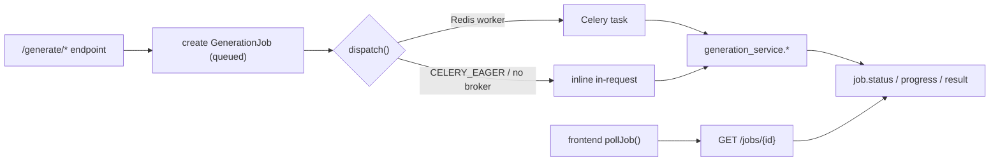
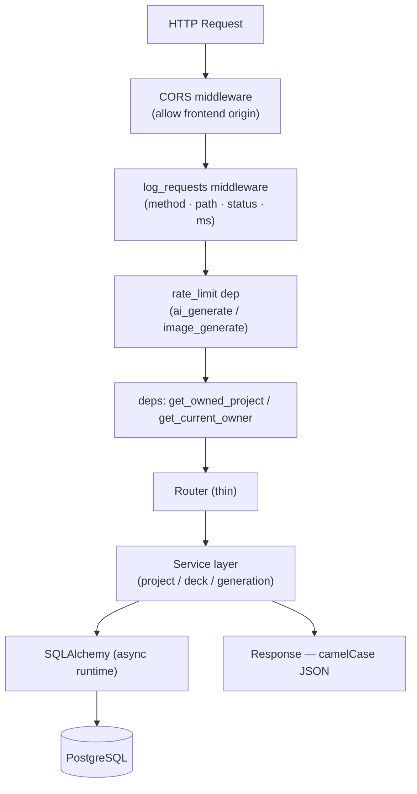
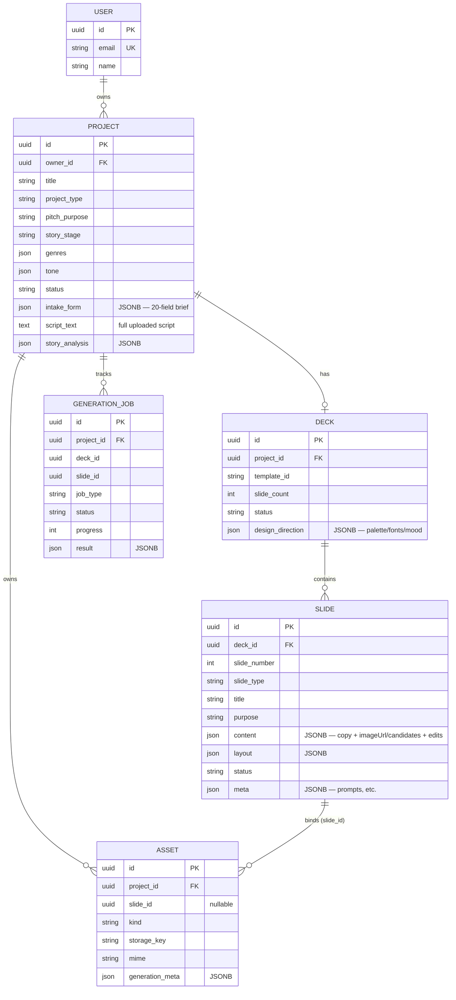

# Architecture Flow — Pitch Deck (AI Cinematic Pitch Deck Builder)

End-to-end architecture and data-flow reference for the **Pitch Deck** platform: turn an
idea / logline / treatment / full script into a producer-ready cinematic pitch deck, then
edit and export it.

> **Diagrams** are written in [Mermaid](https://mermaid.js.org). They render natively on
> GitHub. To use them in **Confluence**, see [Pasting into Confluence](#pasting-into-confluence)
> at the bottom.

---

## 1. System Context



**Principle:** the frontend is a typed client of the backend; the backend serializes
**camelCase** JSON that matches `frontend/src/types/*`. Deck/slide content is stored as
**JSONB**, not normalized columns — slide-shape changes are schema-level (Pydantic + TS),
not DB migrations.

---

## 2. End-to-End Build Flow (happy path)



---

## 3. AI Agent Pipeline (multi-agent orchestration)

Each agent is provider-agnostic and degrades to a deterministic fallback when no AI key is
configured (`AI_OFFLINE=true` or missing keys).



| Agent | File | Output |
|---|---|---|
| `intake_interview` | `ai/agents/intake_interview.py` | next question + running brief |
| `intake_extract` | `ai/agents/intake_extract.py` | `IntakeFormData` from script text |
| `story_analysis` | `ai/agents/story_analysis.py` | theme, emotional core, positioning |
| `design` | `ai/agents/design.py` | `DesignDirection` (palette, fonts, mood) via `registers.py` |
| `outline` | `ai/agents/outline.py` + `ai/templates.py` | ordered slide outline for a template |
| `content` | `ai/agents/content.py` | `SlideContent` (heading/body/items/comps…) |
| `layout` | `ai/agents/layout.py` | template + layout type per slide |
| `image_prompt` | `ai/agents/image_prompt.py` | rights-safe, region-aware diffusion prompt |
| `slide_edit` | `ai/agents/slide_edit.py` | structured deck-edit actions |

All LLM calls flow through **`ai/llm.py` → `complete_json()`** (provider selection, prompt
caching, JSON extraction, deterministic fallback).

---

## 4. Chat Intake Flow



Two shortcuts bypass the chat: **Upload full script** (`/intake/extract`) auto-fills the
whole brief; **Reference deck** (`/references/pptx`) seeds look + structure.

---

## 5. Slide Workshop — Generation Flow



---

## 6. Image Generation Pipeline



- **Auth:** Vertex uses Application Default Credentials (`gcloud auth application-default
  login`) or `VERTEX_CREDENTIALS_PATH`; quota project sent via `x-goog-user-project`.
- **Resilience:** any provider failure (incl. safety filter / quota) falls back to a
  deterministic placeholder; regeneration **keeps the existing image** instead of clobbering.
- Scanned PDFs with no text layer are OCR'd (`ai/ocr.py`) before extraction.

---

## 7. Async Job Model



Long work (full-deck generation, per-slide regen, image variants) runs as a tracked
`GenerationJob`; the frontend polls `GET /jobs/{id}`. With no Redis, work runs inline
(`CELERY_EAGER=true`) — same code path.

---

## 8. Request / Middleware Flow



Routers stay thin; business logic lives in `services/`. Pydantic `CamelModel` enforces the
camelCase contract shared with the frontend types.

---

## 9. Data Model



---

## 10. API Surface (mounted under `/api/v1`)

| Router | Key endpoints | Purpose |
|---|---|---|
| `health` | `GET /health` | liveness |
| `projects` | `POST/GET /projects`, `PUT /{id}/intake`, `POST /{id}/intake/extract`, `POST /{id}/references/pptx`, `POST /{id}/assets/upload-image`, `DELETE /{id}` | projects, intake, uploads |
| `interview` | `POST /interview`, finalize | adaptive chat intake |
| `decks` | `GET /projects/{id}/deck`, `PATCH /slides/{id}` | read deck, edit slide |
| `generate` | `POST /{id}/deck`, `/deck/prepare`, `/deck/assemble`, `/slides/{id}/regenerate`, `/image`, `/regenerate-image`, `/image-variants` | generation |
| `jobs` | `GET /jobs/{id}` | poll async jobs |
| `assets` | `GET /assets/{id}` | serve generated/uploaded images |
| `templates` | `GET /templates` | deck templates |

---

## 11. Key Design Decisions

1. **Provider-agnostic AI** — all LLM/image calls route through `ai/llm.py` and `ai/images.py`; the app runs fully offline with deterministic fallbacks (no vendor lock-in).
2. **JSONB content** — decks/slides stored as flexible JSONB; slide-shape evolves via Pydantic/TS types, not migrations.
3. **camelCase contract** — backend mirrors the frontend TS types; one source of truth for the API shape.
4. **Two DB engines** — async at runtime, sync for Alembic migrations (never mixed).
5. **Inline-or-worker generation** — same code runs under Celery (Redis present) or inline (`CELERY_EAGER`), so local dev needs no broker.
6. **Resilient images** — quota/safety failures fall back to placeholders and never clobber a good image; Vertex retries 429 with backoff.
7. **Keyless cloud auth** — Vertex via Application Default Credentials (no secret key files committed).
8. **Stub auth today** — a dev owner stands in for real auth (`deps.get_current_owner`); JWT/RBAC is the planned next layer.

---

## Pasting into Confluence

**Option A — HTML Viewer & Porter (Recommended — Perfect Formatting):**
1. Open the [view_architecture.html](file:///c:/Users/pc/Desktop/PD/view_architecture.html) file in your browser.
2. Click **"Copy for Confluence"** at the top right (this copies the fully rendered rich text with placeholder slots for diagrams).
3. Paste directly into your Confluence page. Spacing, tables, headers, and styles will render perfectly.
4. Download the **PNG** or **SVG** version of each diagram from the viewer and drag-and-drop them into the corresponding placeholder sections in Confluence.

**Option B — Markdown Importer:**
1. In a Confluence page: **••• (top-right) → Insert → Markup** (Note: this option may be hidden or unavailable in some Confluence Cloud instances).
2. Set type to **Markdown**, paste this file's contents.

**Option C — Live Mermaid Diagrams (Confluence Macro):**
1. Install the **"Mermaid Diagrams for Confluence"** macro from the Atlassian Marketplace.
2. On your page, type `/mermaid`, insert the macro, and paste the code from each ` ```mermaid ` block (without the fences).
3. Copy/paste the surrounding text/tables normally using Option A.

---

_Generated to mirror the actual codebase (`backend/app/*`, `frontend/src/*`). Keep in sync
when the agent pipeline, routers, or data model change._
