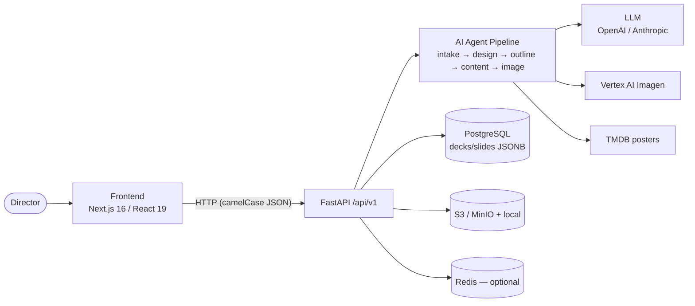

# 🎬 Pitch Deck — AI-Powered Cinematic Pitch Deck Builder

> Turn a one-line idea, logline, concept note, treatment, or full script into a **producer-ready, industry-standard cinematic pitch deck (10–15 slides)** — built for film & series directors, screenwriters, and creators. Telugu-first, expanding pan-India.

The platform conducts an **adaptive AI intake conversation**, extracts & generates the **narrative + market content**, produces **cinematic visuals via diffusion models** anchored to one of five curated style registers, gives the user **total customization control**, runs an AI **structural review**, and exports to **PDF / PPTX / shareable web link** with analytics and async comments.

---

## 🚀 New here? Read [SETUP.md](./SETUP.md)

Team onboarding — Docker infra, backend, frontend, admin login, and every command in one
place. Start there to get running locally.

---

## 🔭 Architecture Flow (start here)

For the full set of **end-to-end flow diagrams** — system context, the build pipeline, the
AI agent chain, chat intake, slide-workshop generation, the image pipeline, the async job
model, request/middleware flow, and the data model — see
**[ARCHITECTURE_FLOW.md](./ARCHITECTURE_FLOW.md)** (Mermaid; renders on GitHub and pastes
into Confluence).



**Build flow:** `intake (chat / script / reference deck)` → `story analysis` → `design
direction` → `outline` → `per-slide content + image` → `assemble` → `editor` → `export`.

---

## 📑 Table of Contents

0. **[Architecture Flow](#-architecture-flow-start-here)** ⭐ — start here (flow diagrams + Confluence-ready)
1. [Tech Stack](#-tech-stack)
2. [High-Level Architecture Diagram](#-high-level-architecture-diagram)
3. [System Components Overview](#-system-components-overview)
4. [Backend Services](#-backend-services)
5. [Database Structure & JSONB Column Design](#-database-structure--jsonb-column-design)
6. [Frontend Architecture](#-frontend-architecture)
7. [Frontend Routes, Modules & Components](#-frontend-routes-modules--components)
8. [API Routes](#-api-routes)
9. [AI Models](#-ai-models)
10. [AI Agent Pipeline (Multi-Agent Orchestration)](#-ai-agent-pipeline-multi-agent-orchestration)
11. [Image Generation Pipeline](#-image-generation-pipeline)
12. [File Storage](#-file-storage)
13. [Reverse Proxy & Networking (Nginx)](#-reverse-proxy--networking-nginx)
14. [Application Flow — Build Order Pipeline](#-application-flow--build-order-pipeline)
15. [Key Design Principles](#-key-design-principles)
16. [Local Development Setup](#-local-development-setup)
17. [Repository Structure](#-repository-structure)

---

## 🧰 Tech Stack

### Frontend
| Layer | Technology |
|-------|-----------|
| Framework | **Next.js 14+ (App Router, RSC)** + TypeScript |
| UI | React 18, **Tailwind CSS**, **shadcn/ui**, Radix primitives |
| State | **Zustand** (editor/UI state) + **TanStack Query** (server state) |
| Rich Text | **Tiptap** (slide text block editing) |
| Drag & Drop | **dnd-kit** (slide reordering) |
| Realtime | **SSE / WebSocket** (intake streaming + generation progress) |
| Auth | **Auth.js (NextAuth)** / Clerk |
| Forms/Validation | React Hook Form + **Zod** |

### Backend
| Layer | Technology |
|-------|-----------|
| API | **Python 3.11+ / FastAPI** (async) |
| Task Queue | **Celery** + **Redis** (image gen, exports, structural review) |
| ORM | **SQLAlchemy 2.0** + Alembic (migrations) |
| Validation | **Pydantic v2** |
| Realtime | FastAPI SSE / WebSocket endpoints |

### Data & Infrastructure
| Layer | Technology |
|-------|-----------|
| Primary DB | **PostgreSQL 16** (+ **JSONB** for slide/deck content) |
| Vector DB | **pgvector** (comps retrieval, style/tone reference search) |
| Cache / Broker | **Redis** |
| Object Storage | **S3 / Cloudflare R2** (uploads, generated images, exports) |
| CDN | Cloudflare / CloudFront (image + export delivery) |
| Search corpus | Validated industry pitch-deck patterns + film metadata (RAG) |

### AI Layer
| Capability | Technology |
|-----------|-----------|
| LLM (intake, NLP, review) | **Claude (Anthropic)** / GPT-4-class — streaming, tool-use |
| Diffusion (images) | **FLUX / SDXL** via **fal.ai / Replicate** (or self-hosted **ComfyUI**) |
| Image-to-Image | SDXL/FLUX img2img + IP-Adapter / ControlNet |
| Embeddings | text-embedding model → pgvector |

### Export Engine
| Format | Technology |
|--------|-----------|
| PDF | **Playwright (headless Chromium)** HTML→PDF render |
| PPTX | **python-pptx** |
| Web link | Next.js public viewer route + analytics events |

### Edge / Infrastructure
| Layer | Technology |
|-------|-----------|
| Reverse Proxy | **Nginx** — single entry point, path routing, TLS, SSE/WS proxy, rate limiting |
| CDN | Cloudflare / CloudFront (static + image/export delivery) |
| Containers | Docker + Docker Compose (dev) / Kubernetes or ECS (prod) |

---

## 🏗 High-Level Architecture Diagram

```text
┌──────────────────────────────────────────────────────────────────────────┐
│  CLIENT (Browser)                                                          │
│  Dashboard / Editor / Viewer   ──►  Zustand + TanStack Query               │
└───────────────────────────────┬──────────────────────────────────────────┘
                                 │  HTTPS / SSE / WS   (+ CDN for static/media)
┌───────────────────────────────▼──────────────────────────────────────────┐
│  NGINX  —  Reverse Proxy / TLS termination / rate-limit / SSE-WS proxy     │
│  routes:  /api/*  ──► FastAPI (:8000)      everything else ──► Next.js      │
└──────────────┬───────────────────────────────────────┬───────────────────┘
               │ (/ and _next, RSC)                     │ (/api/v1, streams)
┌──────────────▼─────────────────────────┐              │
│  NEXT.JS SERVER (BFF) :3000             │              │
│  Server Components · Route Handlers ·   │              │
│  Auth.js                                │              │
└──────────────┬──────────────────────────┘             │
               │  REST /api/v1                           │
               └───────────────┬─────────────────────────┘
                               │
┌───────────────────────────────▼──────────────────────────────────────────┐
│  FASTAPI BACKEND  (API Gateway / Routers)                                  │
│  ┌──────────┬──────────┬──────────┬──────────┬──────────┬──────────┐      │
│  │ Intake   │ Text Gen │ Visual   │ Deck     │ Review   │ Export / │      │
│  │ Service  │ (NLP)    │ Service  │ Assembly │ Service  │ Share    │      │
│  └────┬─────┴────┬─────┴────┬─────┴──────────┴────┬─────┴────┬─────┘      │
└───────┼──────────┼──────────┼─────────────────────┼──────────┼────────────┘
        │          │          │ enqueue             │          │
        │          │          ▼                     ▼          ▼
        │          │   ┌──────────────────────────────────────────┐
        │          │   │  CELERY WORKERS (via Redis broker)         │
        │          │   │  Image Gen  ·  Export  ·  Review           │
        │          │   └───────┬───────────────┬──────────┬────────┘
        ▼          ▼           ▼               │          │
   ┌─────────────────────┐  ┌──────────────┐  │          │
   │  AI PROVIDERS        │  │  Diffusion    │ │          │
   │  LLM (Claude/GPT-4)  │  │  (FLUX/SDXL)  │ │          │
   │  Embeddings          │  └──────────────┘ │          │
   └──────────┬──────────┘                    │          │
              │                               ▼          ▼
   ┌──────────▼───────────────────────────────────────────────────┐
   │  DATA LAYER                                                    │
   │  PostgreSQL (JSONB + pgvector)  ·  Redis (cache/broker)        │
   │  S3 / R2 Object Storage (uploads · images · exports)          │
   └───────────────────────────────────────────────────────────────┘

   [ CineSketch Storyboard Module ] ··· import frames ···► Visual Service
```

---

## 🧩 System Components Overview

The product is composed of **7 functional sub-modules** (per PRD), implemented as cohesive backend services + frontend modules:

1. **Dashboard & Project Management** — projects list, create new, duplicate/variants, CineSketch integration.
2. **AI Intake & Vision Capture** — adaptive conversation, 5 Vision Unlocks, vision confirmation.
3. **AI Text Extraction & Generation (NLP)** — logline, synopsis (3-act), USP, director's note, genre, comps, characters.
4. **AI Visual & Mood Board (Diffusion)** — 5 cinematic style registers, title backgrounds, character art, mood boards, prompt/reference override.
5. **Slide Iteration & Assembly** — flexible 10–15 slide engine, total editing control, dynamic expansion.
6. **Structural Review** — logline/character/tonal/format checks with suggested fixes.
7. **Output & Export** — preview, PDF/PPTX/web link, analytics, async comments, version history.

---

## ⚙️ Backend Services

Each service is a FastAPI router + a service-layer module. Heavy/long-running work is offloaded to Celery.

### 1. `auth_service`
- Session validation, user/org context, RBAC (director, collaborator, producer-viewer).

### 2. `project_service`
- CRUD for projects, format type (feature / limited series / ongoing series / short), status (draft / in_review / completed), style register.
- **Duplicate / Variant** logic (shared `master_project_id`, divergent deck).
- CineSketch frame import hook.

### 3. `intake_service`
- Detects **user state**: `logline_only | partial_material | full_script`.
- Branches the conversation tree accordingly (light extraction vs. deep scaffolding).
- Streams LLM turns (SSE), captures the **5 Vision Unlocks**, persists a structured **Vision Document**.
- Produces the final **Vision Confirmation** summary for user approval.

### 4. `ingestion_service`
- Parses uploaded **PDF / DOCX / FDX** (Final Draft) into normalized text + scene/character structure.
- Chunks + embeds material into pgvector for retrieval during generation.

### 5. `nlp_generation_service`
- Generates **Logline** (Hero + Goal + Conflict + active irony), **3-Act Synopsis**, **USP**, **Director's Note** (draft only), **Genre & Target Audience**, **Comps** (RAG over film corpus, Indian-first), **Character profiles** (emotional wound → dramatic function → goal).
- Strictly grounded to the Vision Document — **no plot hallucination**.

### 6. `visual_service`
- Builds register-anchored prompts, dispatches diffusion jobs (title backgrounds, character portraits, mood board collages).
- Handles **prompt override**, **reference image upload (img2img)**, **variation requests**, and **lock-in**.

### 7. `deck_service`
- Maps generated text + visuals onto the **register-driven slide template**.
- Manages slide ordering, dynamic expansion (add character / season-arc / visual-treatment slides), 10→15 count.
- Instant **register switch** (re-themes without losing content).

### 8. `review_service`
- On-demand structural pass: logline review, character depth, tonal coherence, format completeness → **suggested fixes** (never auto-applied).

### 9. `export_service`
- Renders deck to **PDF** (Playwright) & **PPTX** (python-pptx); generates **shareable web link**.

### 10. `share_analytics_service`
- Public link tokens, view tracking (who, time-per-slide, drop-off), **async timestamped comments**, **version history** snapshots.

---

## 💾 Database Structure & JSONB Column Design

PostgreSQL with relational tables for entities + **JSONB columns** for flexible, fast-evolving content (slides, vision doc, generation settings).

### Entity-Relationship (core tables)

```text
USERS
  └─1:N─ PROJECTS
            ├─1:1─ VISION_DOCUMENTS
            ├─1:N─ INTAKE_SESSIONS
            ├─1:N─ ASSETS
            └─1:N─ DECK_VARIANTS
                      ├─1:N─ SLIDES ──1:N── GENERATION_JOBS
                      ├─1:N─ DECK_VERSIONS
                      ├─1:N─ REVIEW_FINDINGS
                      └─1:N─ SHARE_LINKS
                                ├─1:N─ VIEW_EVENTS
                                └─1:N─ COMMENTS

Legend:  1:1 = one-to-one   1:N = one-to-many
```

### Key Tables & Columns

```sql
-- USERS
users (
  id UUID PK, email, name, role,           -- director | collaborator | producer
  created_at, updated_at
)

-- PROJECTS
projects (
  id UUID PK, owner_id FK→users,
  title TEXT,
  format TEXT,                              -- feature | limited_series | ongoing_series | short
  status TEXT,                              -- draft | in_review | completed
  style_register TEXT,                      -- restrained_cinematic | editorial_warm | high_contrast_genre | playful_bright | pulp_stylized
  starting_point TEXT,                      -- logline | concept_note | treatment | full_script
  source_material JSONB,                    -- normalized parsed input (see below)
  created_at, updated_at, last_edited_at
)

-- VISION_DOCUMENTS  (the heart — confirmed creative intent)
vision_documents (
  id UUID PK, project_id FK,
  user_state TEXT,                          -- logline_only | partial_material | full_script
  vision JSONB,                             -- 5 Vision Unlocks (see below)
  confirmed BOOLEAN DEFAULT false,
  confirmed_at
)

-- INTAKE_SESSIONS
intake_sessions (
  id UUID PK, project_id FK,
  transcript JSONB,                         -- ordered conversation turns
  detected_state TEXT, completed BOOLEAN
)

-- DECK_VARIANTS  (financier / OTT / talent versions share a project)
deck_variants (
  id UUID PK, project_id FK,
  label TEXT,                               -- "OTT version", "Financier version"
  slide_count INT,                          -- 10..16
  outline JSONB,                            -- Deck Outline Agent output (approved structure)
  design_direction JSONB,                   -- Design Direction Agent output (deck-level identity)
  layout_meta JSONB,                        -- ordering, expansions, register overrides
  created_at, updated_at
)

-- SLIDES  (content lives in JSONB — flexible per slide type)
slides (
  id UUID PK, variant_id FK,
  slide_type TEXT,                          -- title | logline_genre | world_hook | synopsis | character | mood_board | comps_audience | budget_timeline | team | ask_status | season_arc | episode_structure | world_bible | visual_treatment | footage_sizzle
  position INT,
  content JSONB,                            -- per-type content (see below)
  layout JSONB,                             -- Slide Layout Agent output (placement/hierarchy/spacing)
  is_locked BOOLEAN, ai_generated BOOLEAN,
  updated_at
)

-- ASSETS  (every image/upload/export)
assets (
  id UUID PK, project_id FK,
  kind TEXT,                                -- upload_ref | title_bg | character_art | mood_image | comp_poster | export_pdf | export_pptx
  storage_key TEXT,                         -- S3 object key
  mime TEXT, width INT, height INT,
  generation_meta JSONB,                    -- prompt, model, seed, register, parent_asset_id
  created_at
)

-- GENERATION_JOBS  (async image/text jobs)
generation_jobs (
  id UUID PK, project_id FK, slide_id FK NULL,
  job_type TEXT,                            -- image | image2image | variation | text | review | export
  status TEXT,                              -- queued | running | succeeded | failed
  params JSONB, result JSONB,
  error TEXT, created_at, finished_at
)

-- REVIEW_FINDINGS
review_findings (
  id UUID PK, variant_id FK,
  category TEXT,                            -- logline | character | tonal | format
  severity TEXT, slide_id FK NULL,
  message TEXT, suggested_fix JSONB,
  resolution TEXT,                          -- accepted | modified | dismissed | open
)

-- SHARE_LINKS / VIEW_EVENTS / COMMENTS / DECK_VERSIONS
share_links ( id UUID PK, variant_id FK, token TEXT UNIQUE, is_active, expires_at )
view_events ( id UUID PK, share_link_id FK, viewer_fingerprint, slide_id FK, dwell_ms, occurred_at )
comments    ( id UUID PK, share_link_id FK, slide_id FK, author_name, body, ts_position, created_at )
deck_versions ( id UUID PK, variant_id FK, snapshot JSONB, label, created_at )
```

### JSONB Column Structures (the flexible payloads)

**`vision_documents.vision`** — the 5 Vision Unlocks:
```jsonc
{
  "dramatic_engine": "A grieving exorcist must doubt his faith to save the child he failed.",
  "emotional_wounds": [
    { "character": "Arjun", "wound": "Survivor's guilt from his daughter's death" }
  ],
  "why_now": "A personal story about faith collapsing in modern Telugu households.",
  "tone_anchors": [
    { "title": "Tumbbad", "note": "slow dread, not playful scares" }
  ],
  "signature_image": "A lone lamp flickering in a flooded temple corridor."
}
```

**`projects.source_material`** — normalized parsed input:
```jsonc
{
  "raw_text": "…",
  "scenes": [ { "heading": "INT. TEMPLE - NIGHT", "summary": "…" } ],
  "characters_detected": ["Arjun", "Meera"],
  "page_count": 118,
  "source_format": "fdx"
}
```

**`slides.content`** — varies by `slide_type`. Examples:
```jsonc
// slide_type: "title"
{ "title": "THE LAST RITE", "credit": "A Film by R. Kumar", "background_asset_id": "uuid" }

// slide_type: "logline_genre"
{ "logline": "…", "genre_primary": "Supernatural Horror", "genre_secondary": ["Family Drama"] }

// slide_type: "synopsis"
{ "act_1_setup": "…", "act_2_conflict": "…", "act_3_resolution": "…" }

// slide_type: "character"
{ "name": "Arjun", "emotional_wound": "…", "dramatic_function": "…",
  "goal": "…", "portrait_asset_id": "uuid" }

// slide_type: "mood_board"
{ "register": "restrained_cinematic", "image_asset_ids": ["uuid","uuid","uuid","uuid"],
  "caption": "Lighting · palette · camera · costume" }

// slide_type: "comps_audience"
{ "comps": [ { "title": "Tumbbad", "poster_asset_id": "uuid", "rationale": "…" } ],
  "target_audience": "18–40 urban Telugu OTT viewers; horror-drama crossover" }

// slide_type: "budget_timeline"
{ "estimated_budget_inr": 150000000, "cost_centers": ["Heavy VFX","Lead actor fee"],
  "shooting_days": 60, "notes": "…" }
```

**`assets.generation_meta`** — full provenance for regeneration/override:
```jsonc
{
  "prompt": "ultra-wide cinematic flooded temple corridor, single oil lamp…",
  "negative_prompt": "text, watermark, modern objects",
  "model": "flux-1.1-pro", "seed": 88213, "steps": 28,
  "register": "restrained_cinematic",
  "mode": "image2image", "reference_asset_id": "uuid",
  "strength": 0.65, "aspect_ratio": "21:9"
}
```

**`deck_variants.layout_meta`** — ordering & expansion state:
```jsonc
{
  "slide_order": ["title","logline_genre","world_hook","synopsis","character","character","mood_board","comps_audience","budget_timeline","team","ask_status"],
  "expansions": { "extra_characters": 1, "season_arc": false },
  "register_override": null
}
```

**`deck_variants.outline`** — Deck Outline Agent output (approved before content):
```jsonc
{
  "tailored_for": { "pitch_purpose": "investor", "story_stage": "partial_script" },
  "slides": [
    { "type": "title",          "include": true,  "reason": "Always" },
    { "type": "logline_genre",  "include": true,  "reason": "Hook" },
    { "type": "market_potential","include": true, "reason": "Investor focus" },
    { "type": "budget_timeline","include": true,  "reason": "Investor focus" },
    { "type": "season_arc",     "include": false, "reason": "Not a series" }
  ],
  "approved": true
}
```

**`deck_variants.design_direction`** — Design Direction Agent output (deck-level cinematic identity):
```jsonc
{
  "register": "restrained_cinematic",
  "mood": "slow-burn dread, sacred decay",
  "palette": { "bg": "#0B0B0D", "accent": "#B8862F", "text": "#EDE7DA" },
  "typography": { "display": "Cormorant", "body": "Inter", "scale": "1.25" },
  "image_style": "desaturated, single-source warm light, deep shadows, 35mm grain",
  "layout_style": "asymmetric, generous negative space, full-bleed imagery",
  "background_style": "dark textured, vignette",
  "visual_rhythm": "alternate full-bleed image ↔ text-led slides"
}
```

**`slides.layout`** — Slide Layout Agent output (per-slide placement):
```jsonc
{
  "template": "image_left_text_right",
  "blocks": [
    { "id": "title",  "area": "top-left",  "align": "left",  "max_w": "60%" },
    { "id": "body",   "area": "left",      "align": "left" },
    { "id": "image",  "area": "right",     "fit": "cover", "asset_id": "uuid" }
  ],
  "hierarchy": ["title","body","image"],
  "spacing": { "gutter": 32, "padding": 64 }
}
```

> **Indexing:** GIN indexes on JSONB columns (`slides.content`, `vision_documents.vision`) for queryability; B-tree on FKs/status; **ivfflat/HNSW** on pgvector embedding columns for comps retrieval.

---

## 🎨 Frontend Architecture

```text
┌─────────────────────────────────────────────────────────────┐
│  NEXT.JS APP ROUTER                                           │
│  Route Segments / Pages · Shared Layouts · Route Handlers(BFF)│
└───────────────────────────┬─────────────────────────────────┘
                            │
                            ▼
┌─────────────────────────────────────────────────────────────┐
│  FEATURE MODULES                                              │
│  Dashboard · Intake · Editor · Review · Viewer · Export       │
└───────────────────────────┬─────────────────────────────────┘
                            │
                            ▼
┌─────────────────────────────────────────────────────────────┐
│  SHARED LAYER                                                 │
│  UI Components (shadcn/ui)                                     │
│  Hooks: useDeck · useIntakeStream · useGenerationJob          │
│  Zustand stores + TanStack Query                              │
│  Typed API client + Zod schemas  ──────────►  FastAPI Backend │
└─────────────────────────────────────────────────────────────┘
```

- **Server Components** for data-heavy reads (dashboard lists, viewer).
- **Client Components** for interactive editor (drag-drop, inline editing, live generation).
- **Streaming** via SSE hooks for intake chat & generation progress.
- **Optimistic updates** through TanStack Query mutations on slide edits.

---

## 🗺 Frontend Routes, Modules & Components

### App Router Routes
```
/                              → Landing / marketing
/login                         → Auth
/dashboard                     → Projects overview (list, status, register)
/projects/new                  → Create New Pitch (title + starting point)
/projects/[id]/intake          → AI Intake conversation (adaptive)
/projects/[id]/generating      → Generation progress (text + visuals)
/projects/[id]/editor          → Slide Iteration & Assembly workspace
/projects/[id]/editor/[slide]  → Focused single-slide editor
/projects/[id]/review          → Structural Review panel
/projects/[id]/variants        → Manage deck variants (OTT / financier / talent)
/projects/[id]/preview         → Full-screen Preview Mode
/projects/[id]/export          → Export (PDF / PPTX / link)
/share/[token]                 → Public Viewer (analytics + async comments)
```

### Feature Modules → Key Components

| Module | Components |
|--------|-----------|
| **Dashboard** | `ProjectGrid`, `ProjectCard`, `CreatePitchWizard`, `VariantBadge`, `StatusChip` |
| **Intake** | `IntakeChat`, `MessageStream`, `VisionUnlockTracker`, `VisionConfirmCard`, `StatePill` |
| **Editor** | `SlideCanvas`, `SlideList` (dnd-kit), `SlideThumbnail`, `TextBlockEditor` (Tiptap), `ImageBlock`, `GenerationSettingsDrawer` (prompt + reference upload + variations), `RegisterSwitcher`, `AddSlideMenu`, `BudgetForm`, `CharacterCard`, `MoodBoardGrid`, `CompsPicker` |
| **Review** | `ReviewPanel`, `FindingCard`, `SuggestedFixDiff`, `AcceptDismissControls` |
| **Viewer** | `DeckViewer`, `SlideRenderer`, `CommentThread`, `SlideTimeline` |
| **Export** | `ExportDialog`, `FormatSelector`, `ShareLinkManager`, `AnalyticsSummary` |
| **Shared** | `RegisterTheme` provider, `AssetUploader`, `JobProgress`, `Toast`, `EmptyState` |

---

## 🔌 API Routes

> Base: `/api/v1` (FastAPI). Auth via Bearer/session. Long jobs return a `job_id` (poll `/jobs/{id}` or subscribe SSE).

### Projects & Variants
```
GET    /projects                      List projects (dashboard)
POST   /projects                      Create new pitch (title + starting_point)
GET    /projects/{id}                 Project detail
PATCH  /projects/{id}                 Update title/status/register
DELETE /projects/{id}
POST   /projects/{id}/duplicate       Create a variant
POST   /projects/{id}/import-storyboard   Import CineSketch frames
GET    /projects/{id}/variants
POST   /projects/{id}/variants
```

### Ingestion & Intake
```
POST   /projects/{id}/upload          Upload concept/treatment/script (PDF/DOCX/FDX)
POST   /intake/{project_id}/start     Begin adaptive intake
POST   /intake/{project_id}/message   Send turn  (SSE stream response)
GET    /intake/{project_id}/stream    SSE event stream
POST   /intake/{project_id}/confirm   Confirm/correct Vision Document
GET    /projects/{id}/vision          Get Vision Document
```

### Outline & Design (Agents)
```
POST   /outline/{variant_id}/generate          Deck Outline Agent
PATCH  /outline/{variant_id}                    Approve / reorder / add / remove slides
POST   /outline/{variant_id}/regenerate
POST   /design/{variant_id}/generate            Design Direction Agent (deck identity)
POST   /layout/{slide_id}/generate              Slide Layout Agent (per-slide layout JSON)
```

### Text Generation (NLP)
```
POST   /generate/{project_id}/logline
POST   /generate/{project_id}/synopsis
POST   /generate/{project_id}/usp
POST   /generate/{project_id}/director-note
POST   /generate/{project_id}/genre-audience
POST   /generate/{project_id}/comps           (RAG, Indian-first)
POST   /generate/{project_id}/characters
POST   /generate/{project_id}/deck             Generate full deck content
```

### Visuals (Diffusion)
```
POST   /visuals/{project_id}/title-bg
POST   /visuals/{project_id}/character/{slide_id}
POST   /visuals/{project_id}/mood-board
POST   /visuals/{slide_id}/regenerate          With overridden prompt
POST   /visuals/{slide_id}/img2img             Reference-image guided
POST   /visuals/{slide_id}/variations          n variations
POST   /visuals/{asset_id}/lock                Lock chosen asset
```

### Slides & Deck
```
GET    /variants/{id}/slides
PATCH  /slides/{id}                    Edit content (text/image swap)
POST   /slides/{id}/lock
POST   /variants/{id}/slides           Add slide (character/season-arc/visual-treatment)
DELETE /slides/{id}
PATCH  /variants/{id}/reorder          Drag-drop ordering
POST   /variants/{id}/switch-register  Re-theme deck
```

### Review · Export · Share
```
POST   /review/{variant_id}/run        Structural review (async)
GET    /review/{variant_id}/findings
PATCH  /findings/{id}                   accept | modify | dismiss
POST   /export/{variant_id}/pdf
POST   /export/{variant_id}/pptx
POST   /export/{variant_id}/share       Create share link
GET    /share/{token}                   Public deck payload
POST   /share/{token}/view-event        Analytics ping (dwell/slide)
POST   /share/{token}/comment           Async timestamped comment
GET    /variants/{id}/versions          Version history
POST   /variants/{id}/versions/restore
GET    /jobs/{id}                        Poll async job status
```

---

## 🤖 AI Models

| Role | Model | Notes |
|------|-------|-------|
| **Intake conversation** | Claude (Anthropic) / GPT-4-class | Streaming, branch logic on user state, tool-use for structured vision capture |
| **NLP generation** | Same LLM, low-temperature, grounded prompts | Logline / synopsis / USP / characters — strictly grounded to Vision Doc, **no hallucinated plot** |
| **Comps retrieval** | Embeddings + RAG over Indian film corpus | pgvector similarity → LLM rerank, Indian-first |
| **Structural review** | LLM with rubric derived from validated decks | Returns findings + suggested fixes |
| **Title / world backgrounds** | **FLUX.1 / SDXL** | Ultra-wide 21:9 cinematic, register-anchored |
| **Character portraits** | SDXL/FLUX + IP-Adapter | Wound/personality-driven, **not actor lookalikes** (rights-safe) |
| **Mood boards** | SDXL/FLUX (batch 4–6) | Lighting/palette/camera/costume collage |
| **Image-to-Image** | SDXL/FLUX img2img + ControlNet | User reference image → guided output |

**Cinematic Style Registers** (each = a complete prompt system: palette, lighting, lens, grain, typography):
`Restrained Cinematic` · `Editorial Warm` · `High-Contrast Genre` · `Playful Bright` · `Pulp Stylized`.

---

## 🧠 AI Agent Pipeline (Multi-Agent Orchestration)

The generation flow is implemented as a **chain of specialized AI agents**, each with a single responsibility, a typed input contract, and a structured JSON output. Agents are orchestrated by the backend (`orchestrator`), persist their outputs as tracked `generation_jobs`, and every step is **user-reviewable before the next agent runs** (human-in-the-loop gates).

```text
  Project Setup  (type · purpose · stage · language · genre · tone · status)
        │
        ▼
  [1] AI Intake Agent          understands input · detects gaps · asks follow-ups
        │
        ▼
  [2] Story Analysis Agent     theme · emotional core · genre DNA · tone ·
        │                      audience · commercial angle · comps · visual world
        ▼
  [3] Deck Outline Agent ◄──────────────┐  builds 15–16 slide structure
        │                               │  (adapts to purpose + stage)
        ▼                               │
   <GATE> User reviews outline ─ regen ─┘
        │  approve   (approve · reorder · add · remove · regenerate)
        ▼
  [4] Slide Content Agent      writes every slide's copy
        │
        ▼
   <GATE> User content review   (edit · regen slide · regen all · approve)
        │  approve
        ▼
  [5] Design Direction Agent   mood · palette · typography · image style ·
        │                      layout style · backgrounds · cinematic identity
        ▼
  [6] Image Prompt Agent       cover · character · world · moodboard · aesthetic
        │
        ▼
  [7] Slide Layout Agent       per-slide placement · hierarchy · spacing → layout JSON
        │
        ▼
  [8] Slide Renderer           deck JSON + slide JSON + design JSON → editable slides
        │
        ▼
      Slide Editor             edit text · swap/regen image · regen design ·
        │                      reorder · duplicate · delete
        ▼
  [9] Quality Review Agent     clarity · order · length · investor-readiness ·
        │                      visual + genre consistency
        ▼
      Export Engine            PDF · PPTX · save · download
```

### Agents & Responsibilities

| # | Agent | Input | Output (structured) | User Gate |
|---|-------|-------|----------------------|-----------|
| 1 | **AI Intake Agent** | Raw form + uploads | Detected `project_type`, `pitch_purpose`, `story_stage`, missing-info list, follow-up questions | Answers missing questions |
| 2 | **Story Analysis Agent** | Confirmed inputs | `theme`, `emotional_core`, `genre_dna`, `tone`, `audience`, `commercial_angle`, `comps`, `visual_world` | — |
| 3 | **Deck Outline Agent** | Story analysis + purpose + stage | Ordered 15–16 slide outline (which slides, why) | **Approve / reorder / add / remove / regenerate** |
| 4 | **Slide Content Agent** | Approved outline + analysis | Per-slide copy (title, logline, synopsis, characters, USP, comps, audience, market, budget, vision, closing) | **Edit / regen slide / regen all / approve** |
| 5 | **Design Direction Agent** | Genre + tone + register | Deck-level **design JSON** (mood, palette, typography, image style, layout style, backgrounds, rhythm, cinematic identity) | — |
| 6 | **Image Prompt Agent** | Content + design direction | Prompts for cover, characters, world, moodboard, aesthetic | Edit prompts (Total Customization) |
| 7 | **Slide Layout Agent** | Content + design JSON | Per-slide **layout JSON** (placement, hierarchy, spacing, colors) | — |
| 8 | **Slide Renderer** | deck JSON + slide JSON + design JSON | Editable React slides + preview | Slide Editor |
| 9 | **Quality Review Agent** | Assembled deck | Findings + suggested fixes (clarity, order, length, investor-readiness, visual/genre consistency) | **Accept / modify / dismiss** |

> These agents map onto the backend services: Intake/Story → `intake_service` + `nlp_generation_service`; Outline/Content → `deck_service` + `nlp_generation_service`; Design/Image-Prompt/Layout → `visual_service` + `deck_service`; Quality Review → `review_service`; Export Engine → `export_service`. The agent layer lives in `backend/app/ai/agents/`, each agent a prompt + tool-schema + Pydantic output contract.

### Project Setup Fields (captured before intake)

```jsonc
{
  "project_type": "film | web_series | short_film | documentary",
  "pitch_purpose": "investor | ott | studio | producer | festival",
  "story_stage":  "raw_idea | partial_script | full_script | shot_footage",
  "language":     "Telugu",
  "genre":        ["Supernatural Horror", "Family Drama"],
  "tone":         "slow_burn_dread",
  "production_status": "development | pre_production | in_production | post"
}
```

> The outline & slide set **adapt to `pitch_purpose` and `story_stage`** — e.g. a *festival* deck emphasizes director vision & visual treatment; an *investor* deck emphasizes market potential & budget positioning; a *shot_footage* project can surface a "Footage / Sizzle" slide.

---

## 🖼 Image Generation Pipeline

```text
User(Editor)      Next.js        visual_service      Redis Q     Celery Worker    Diffusion      S3/R2
     │               │                 │                │              │              │            │
     │ request image │                 │                │              │              │            │
     ├──────────────►│ POST /visuals.. │                │              │              │            │
     │               ├────────────────►│ build register-anchored prompt│              │            │
     │               │                 │ (+ neg prompt, aspect ratio)  │              │            │
     │               │                 ├──enqueue job──►│              │              │            │
     │               │◄──202 {job_id}──┤                │              │              │            │
     │               │                 │                │◄─pull job────┤              │            │
     │               │                 │     ┌── img2img: fetch ref ───┼─────────────►│ (S3)       │
     │               │                 │     │          │              ├──img2img────►│            │
     │               │                 │     └── txt2img:│              ├──txt2img────►│            │
     │               │                 │                │              │◄─image bytes─┤            │
     │               │                 │                │              ├──upload asset + thumb────►│
     │               │                 │◄─update job result + generation_meta (succeeded)──────────┤
     │               ├──poll /jobs/{id} or SSE──────────►│              │              │            │
     │               │◄──asset URL(s)──┤                │              │              │            │
     │ pick variation ──► POST /visuals/{asset_id}/lock  │              │              │            │
     ▼               ▼                 ▼                ▼              ▼              ▼            ▼
```

**Pipeline stages:**
1. **Prompt assembly** — merge slide context + Vision Doc + selected **register design language** → final prompt + negative prompt + aspect ratio.
2. **Mode select** — `txt2img` (fresh) vs `img2img` (user reference / regenerate with seed).
3. **Queue & generate** — Celery worker calls diffusion provider; supports **N variations**.
4. **Post-process** — upscale, crop to slide aspect, generate thumbnail.
5. **Store & attribute** — upload to S3, persist full `generation_meta` for reproducibility/override.
6. **Lock-in** — user selects → asset bound to slide; unselected variations retained for history.
7. **Register coherence** — switching register re-runs prompts under new design language so the **whole deck stays visually consistent**.

---

## 🗂 File Storage

| Bucket / Prefix | Contents | Access |
|-----------------|----------|--------|
| `uploads/{project_id}/` | Source scripts (PDF/DOCX/FDX), reference images | Private (signed URLs) |
| `generated/{project_id}/images/` | Title BGs, character art, mood images, variations | Private → CDN signed |
| `comps/posters/` | Comparable film posters (corpus) | Cached / CDN |
| `exports/{variant_id}/` | PDF & PPTX outputs | Signed, time-limited |
| `thumbnails/` | Slide & asset thumbnails | CDN |

- **S3 / Cloudflare R2** as backing store; **CDN** in front for delivery.
- All access via **pre-signed URLs**; no public buckets.
- `assets` table is the source of truth (storage_key + metadata); object lifecycle rules archive old variations.

---

## 🌐 Reverse Proxy & Networking (Nginx)

The app runs as **two separate servers** — Next.js (`:3000`) and FastAPI (`:8000`) — plus object storage and long-lived streaming connections. **Nginx sits in front as the single public entry point (reverse proxy)** so the browser talks to one domain over HTTPS and never sees internal ports.

### Why Nginx is needed here

| Role | What it does | Why it matters for this app |
|------|--------------|-----------------------------|
| **Single entry + path routing** | `/api/*` → FastAPI, everything else → Next.js | One domain, no CORS issues, clean separation of frontend & backend |
| **TLS / HTTPS termination** | Holds the SSL cert (Let's Encrypt), decrypts once at the edge | Apps behind it speak plain HTTP internally; one place to manage certs |
| **SSE / WebSocket proxy** | `proxy_buffering off`, long read timeouts, `Upgrade` headers | **Intake chat streaming** & **generation-progress** streams don't get buffered or dropped |
| **Load balancing** | `upstream` blocks across multiple app instances | Scale FastAPI/Next.js horizontally without client changes |
| **Large upload handling** | `client_max_body_size` (e.g. 100M), request streaming | Big script uploads (PDF/DOCX/FDX) reach FastAPI safely |
| **Rate limiting** | Throttle per-IP on expensive routes | Protects costly AI endpoints (`/generate`, `/visuals`) from abuse/cost spikes |
| **Compression & caching** | gzip/brotli, cache `_next/static` assets | Faster loads, less app-server work |
| **Media offload** | Redirect/proxy to CDN + S3 signed URLs | Keeps app servers free of heavy image/export traffic |

> In production, Nginx is typically paired with a **CDN** (Cloudflare/CloudFront) in front for global static & image delivery. Nginx owns app/API routing + TLS + streaming; the CDN owns edge caching.

### Request routing (simplified `nginx.conf`)

```nginx
upstream nextjs  { server frontend:3000; }
upstream fastapi { server backend:8000; }

server {
    listen 443 ssl http2;
    server_name pitchdeck.app;
    ssl_certificate     /etc/letsencrypt/live/pitchdeck.app/fullchain.pem;
    ssl_certificate_key /etc/letsencrypt/live/pitchdeck.app/privkey.pem;

    client_max_body_size 100M;          # large script uploads
    gzip on;

    # Rate-limit expensive AI endpoints
    limit_req_zone $binary_remote_addr zone=ai:10m rate=10r/m;

    # API → FastAPI
    location /api/ {
        limit_req zone=ai burst=20 nodelay;
        proxy_pass http://fastapi;
        proxy_set_header Host $host;
        proxy_set_header X-Real-IP $remote_addr;
    }

    # SSE / WebSocket streams (intake chat, generation progress)
    location /api/v1/intake/ {
        proxy_pass http://fastapi;
        proxy_http_version 1.1;
        proxy_set_header Connection '';
        proxy_set_header Upgrade $http_upgrade;
        proxy_buffering off;            # critical for streaming
        proxy_read_timeout 3600s;
    }

    # Everything else → Next.js
    location / {
        proxy_pass http://nextjs;
        proxy_set_header Host $host;
    }
}

# Redirect HTTP → HTTPS
server { listen 80; server_name pitchdeck.app; return 301 https://$host$request_uri; }
```

---

## 🔄 Application Flow — Build Order Pipeline

The end-to-end functional pipeline, **in order**:

```text
 1. Create Project + Setup     type · purpose · stage · language · genre · tone · status
        │
 2. Upload / Provide Material  logline · concept · treatment · script
        │
 3. Adaptive AI Intake         detect state · detect gaps · follow-ups
        │
 4. Vision Unlocks + Story     engine · wounds · why-now · tone · signature image
        │
 5. Vision Confirmation        user approves / corrects
        │
 6. Deck Outline  ◄──── regen ────┐   15–16 slide structure (purpose + stage)
        │                         │
     <GATE> review outline ───────┘   approve · reorder · add · remove · regen
        │ approve
 7. NLP Slide Content          logline · synopsis · USP · genre · comps · characters
        │
     <GATE> content review         edit · regen · approve
        │ approve
 8. Design Direction           mood · palette · typography · cinematic identity
        │
 9. Image Prompts + Visuals    register-anchored cover · portraits · mood board
        │
10. Slide Layout               per-slide placement → layout JSON
        │
11. Render + Assembly          deck JSON + slide JSON + design JSON → editable slides
        │
12. Total Customization        edit text · swap layouts · override prompts · upload refs
        │
13. Dynamic Expansion          add character / season-arc / visual-treatment slides
        │
14. Quality / Structural Review  flags + suggested fixes — accept / dismiss
        │
15. Preview Mode               flow · pacing · readability
        │
16. Export                     PDF · PPTX · Web Link
        │
17. Share & Collaborate        analytics · async comments · version history
```

**Order rationale:** nothing is generated until the **Vision Document is confirmed** (step 5), and **no slide copy is written until the outline is approved** (step 6) — this guarantees structure and intent are locked before expensive content/visual generation. Text precedes design (content drives the design brief); design precedes image prompts & layout (the cinematic identity governs every visual); layout precedes render; customization & review happen on the assembled deck before export.

---

## 🎯 Key Design Principles

1. **Vision-First, Not Template-First** — no slide is generated until the director confirms the captured Vision Document. The intake is the core differentiator.
2. **Total User Agency** — every text block, image, layout, and AI prompt is **manually overridable**. Nothing is locked from the user; AI output is always a starting draft (esp. Director's Note — *never auto-finalized*).
3. **Grounded Generation, Zero Hallucination** — NLP is strictly grounded to user material + Vision Doc; the model never invents plot points absent from input.
4. **Visual Coherence via Style Registers** — one chosen register governs the entire deck's design language; switching re-renders everything consistently, no cross-register mixing in v1.
5. **Emotional-Wound-First Characters** — character pages lead with wound → dramatic function → goal, never physical descriptors alone.
6. **Culturally-Calibrated Market Intelligence** — comps & audience are Telugu/pan-India first, internationally relevant where applicable.
7. **Rights-Safe Visuals** — character art is personality/wound-driven, **not** photoreal actor lookalikes.
8. **Dynamic but Bounded** — flexible 10→15 slide engine that never breaks pagination, layout, or export integrity.
9. **Async-First & Job-Based** — all heavy AI work runs as tracked jobs with progress streaming; UI stays responsive and optimistic.
10. **Provenance & Reproducibility** — every generated asset stores full `generation_meta` (prompt, model, seed, register, reference) enabling exact regeneration & overrides.
11. **Producer-Readable Output** — final deck is scannable in <5 minutes: story, characters, tone, budget, market.
12. **Composable Variants** — one creative core spawns audience-tailored variants (OTT / financier / talent) without duplicating source material.

---

## 🛠 Local Development Setup

```bash
# 1. Clone
git clone <repo-url> && cd PD

# 2. Infra (Postgres + Redis)
docker compose up -d            # postgres(pgvector), redis, minio(s3-compatible)

# 3. Backend (Python / FastAPI)
cd backend
python -m venv .venv && .venv\Scripts\activate     # Windows
pip install -r requirements.txt
alembic upgrade head
uvicorn app.main:app --reload --port 8000
# Worker:
celery -A app.worker worker -l info

# 4. Frontend (Next.js)
cd ../frontend
npm install
npm run dev                     # http://localhost:3000
```

**Required env vars (excerpt):**
```env
DATABASE_URL=postgresql+asyncpg://...
REDIS_URL=redis://localhost:6379/0
S3_ENDPOINT=... S3_BUCKET=... S3_KEY=... S3_SECRET=...
ANTHROPIC_API_KEY=...           # LLM
FAL_KEY= / REPLICATE_API_TOKEN= # Diffusion
NEXTAUTH_SECRET=...
```

---

## 📁 Repository Structure

```
PD/
├── docs/                       # PRD source documents
├── frontend/                   # Next.js (App Router)
│   ├── app/                    # Routes (dashboard, intake, editor, viewer, share)
│   ├── components/             # shadcn/ui + feature components
│   ├── features/               # dashboard | intake | editor | review | viewer | export
│   ├── lib/                    # api client, zod schemas, stores, hooks
│   └── styles/                 # register themes, tailwind
├── backend/                    # FastAPI
│   ├── app/
│   │   ├── routers/            # projects, intake, generate, visuals, deck, review, export, share
│   │   ├── services/           # business logic per module
│   │   ├── models/             # SQLAlchemy models
│   │   ├── schemas/            # Pydantic schemas
│   │   ├── ai/                 # llm/diffusion clients, prompt builders, registers
│   │   │   ├── agents/         # intake, story_analysis, outline, content, design, image_prompt, layout, quality_review
│   │   │   └── orchestrator.py # chains agents, manages human-in-the-loop gates
│   │   ├── workers/            # Celery tasks (image, export, review)
│   │   └── core/               # config, db, storage, auth
│   └── alembic/                # migrations
├── nginx/
│   ├── nginx.conf              # reverse proxy: routing, TLS, SSE/WS, rate-limit
│   └── Dockerfile
├── docker-compose.yml          # nginx · frontend · backend · worker · postgres · redis · minio
└── README.md
```

---

*Built for film & series directors who deserve producer-ready decks without graphic-design skills — and for producers who deserve to evaluate a project in 5 minutes, not 120 pages.*
